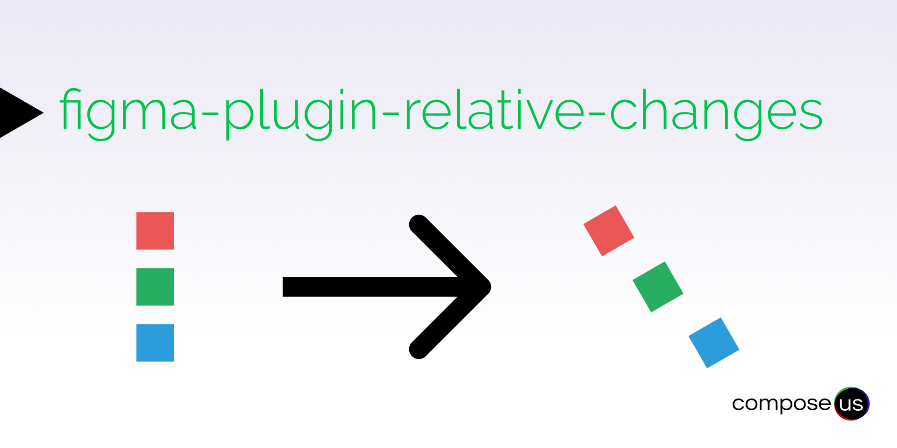

#figma-plugin-relative-changes

This plugin you can apply changes to a group of elements (figma nodes) relative to the selection.

## How to use

After installing the plugin. Select a group of elements, launch the plugin and change the `rotation`, `scale`, and
`dimensions` of each of the elements of your selection.

## About Us

[compose.us GmbH](https://compose.us) is a team of remote developers. We focus on community digitalization.
